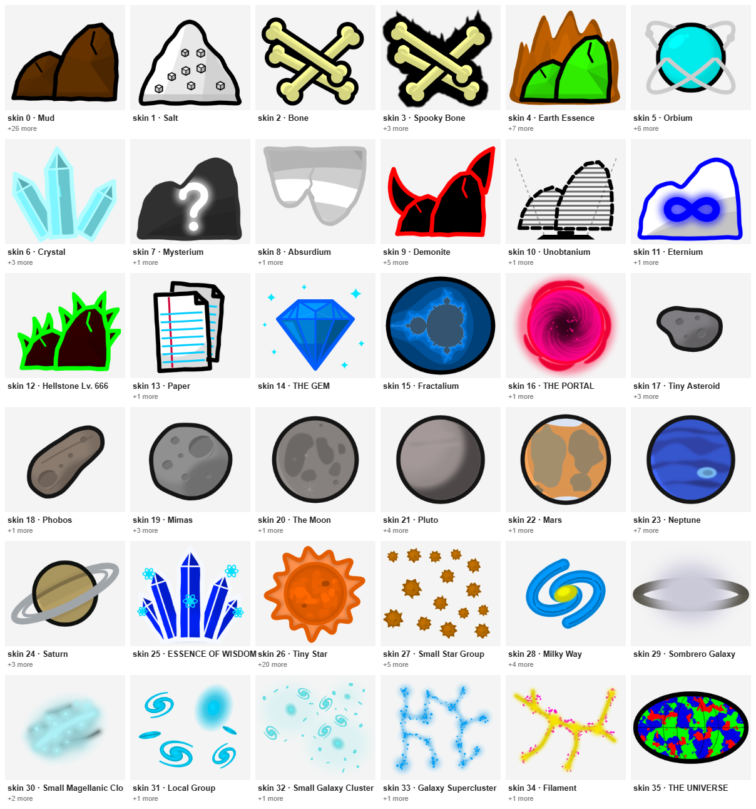
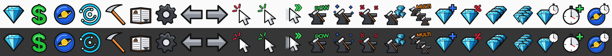

# Beyond art pack

Redrawn mine objects, UI icons, and logos for Idle Mine Beyond. **Not shipped.** The web build serves only `apps/web/static`, and the game keeps drawing the unmodified Remix images until parity-v1. Adopting this pack is a post-parity proposal. It needs an approved entry in [behavioral exceptions](../../docs/knowledge/BEHAVIORAL_EXCEPTIONS.md) before any product code references it. See the [post-parity backlog](../../docs/knowledge/POST_PARITY_BACKLOG.md).

## Layout

`Images/` mirrors the Remix `Images/` tree. Each file keeps the name and pixel size of the Remix image it replaces, so adopting the pack means switching the image base path, not remapping names.

| Path                                      | Content                                                                                                                                                                                                       |
| ----------------------------------------- | ------------------------------------------------------------------------------------------------------------------------------------------------------------------------------------------------------------- |
| `Images/stone_new.png`                    | Mine-object atlas, 1024×10240. Same contract as Remix: 4 grayscale layer columns × 40 skin rows of 256×256 cells, art in the top 256×224, tinted by `drawStone`. Skins 0–35 are drawn; rows 36–39 stay empty. |
| `Images/*.png`, `Images/upgrades/*.png`   | The 24 UI icons the web app serves, at their Remix sizes (128 or 192 px).                                                                                                                                     |
| `Images/logo.png`, `Images/logo_wide.png` | "Idle Mine: Beyond" logos at the sizes of Remix `logo.png` and `logo_crazygames.png`. The web app uses neither today.                                                                                         |
| `Images@2x/`                              | The atlas and icons at twice the size, for high-density displays.                                                                                                                                             |
| `preview/`                                | Contact sheets of the new art only.                                                                                                                                                                           |
| `manifest.json`                           | Generator commit, Remix reference pin, and each file's size, scale, replaced Remix path, and SHA-256.                                                                                                         |

The three Settings social icons are not redrawn: they are third-party brand marks.

## Provenance

The art is drawn by hand-written SVG code in a separate art lab, then rasterized in headless Chromium. No AI image generation was used, and no file contains Remix pixels. The Remix art was used only as a contract and for side-by-side comparison: file names, sizes, atlas layout, which layers each skin uses, and object colors. Icon labels and logos render Montserrat Regular (SIL OFL 1.1) from `apps/web/static/fonts/montserrat`. The full record is in [IP provenance](../../docs/knowledge/ip-provenance.md#beyond-art-pack).

## Validation

`pnpm assets:check` runs `scripts/check-beyond-art.mjs`. It fails when:

- any file is unlisted, or its hash or PNG size differs from the manifest;
- an image stops matching the size of the Remix image it replaces (×2 in `Images@2x/`);
- a served Remix image lacks a 1x or 2x counterpart;
- product source under `apps/` or `packages/` references `art/beyond` while the manifest status is `not-shipped`.

## Regenerating

The pack is rebuilt from the art lab (`idle-mine-beyond-art`) with `node tools/game-pack.mjs`. The tool refuses uncommitted lab sources, records the lab commit in the manifest, and rewrites only `Images/`, `Images@2x/`, `preview/`, and `manifest.json`.
